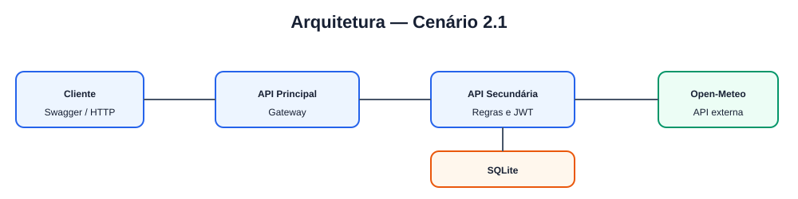

# Outdoor Planner Gateway

API pública do Planejador de Atividades ao Ar Livre. O usuário cadastra atividades e recebe uma avaliação meteorológica para o local e horário planejados. O gateway encaminha REST e Bearer Token; não acessa SQLite, não gera JWT e não chama a Open-Meteo diretamente.

## Arquitetura



Os três módulos são: API Principal, API Secundária e Open-Meteo (serviço externo público). A Open-Meteo não precisa de pasta ou container próprio porque é fornecida por terceiros.

## Instalação e execução

Pré-requisitos: Docker e Docker Compose.

```bash
cd outdoor-planner-gateway
cp .env.example .env
docker compose up --build
```

Swagger: http://localhost:8000/docs. Para encerrar: `docker compose down`.

## Demonstração no Swagger

1. `POST /api/v1/auth/register` com `nome`, `email` e `senha`.
2. `POST /api/v1/auth/login`; copie `token_acesso`.
3. Use **Authorize** com `Bearer <token_acesso>`.
4. Crie, liste, consulte, altere e exclua em `/api/v1/atividades`.
5. Gere a avaliação em `/api/v1/atividades/{atividade_id}/avaliacoes`.

## API externa

O serviço usa `GET https://api.open-meteo.com/v1/forecast`. Não exige cadastro nem chave para o uso acadêmico gratuito. Consulta temperatura, probabilidade de precipitação, código do tempo e vento.

Provider: Open-Meteo  
Website: https://open-meteo.com/  
License: CC BY 4.0

As avaliações são informativas e não garantem segurança.
